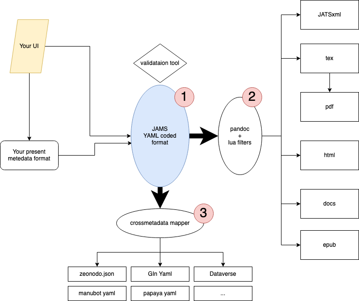

# Group discussions 2022-03-10

- pandoc: https://pandoc.org/jats : not complete compared to jams
- validation: via API or direct javascript
- write a blog post-like text in the discussion, to present the project.
- talk to coko, organise a hackathon

# Group decisions 2022-02-07

- We go for one extra type for groups, as it may be easier for the users and for the validation, we use the PID entry to add simple links (PID type is then URL)
- For validation, we will produce a json version of the template,there are tools doing it automatically, but need example entries
- Julien will update the yaml template
- Axel and Frederick will look at validation
- We will present our results at the next SingleSourcePublishing meeting
- Once validation is set, we will look for human validataion, trying it out
- Pandoc integration still need to be discussed (Albert was not there)
- We may also write a blog post to describe JAMS.

We also had nice discussion about groups: how to deal with groups evolving through time, how to best give credit and link using groups?

# Group decisions 2021-09-06

- description of project and v1: looks ok, note that given names can be inside string-name in jats
- We should have a validator (means use json)
- prepare a larger example (more authors, more affiliations)
- hopefully example could be push to pandoc to get a pdf

# Group decisions 2021-01-18

- barcamp note: https://cryptpad.fr/pad/#/2/pad/edit/Xv5NMPdzST31pmit6tdgDm5K/
    - make things interoperable and transportable
    - make tools that one can build from.
- no big issues with pandoc, just need works
- goal is to get v1.0 published in 2 weeks ;)

# Group decisions 2020-10-01

- Priority is to get affiliation in pandoc accepted metadata
- prototype needs some extension (PR to come)
- roles and types for authors need some documentation.
- Notes: look into funding-statement in pandoc

# Group decisions 2020-10-01

- We will concentrate our efforts to get a backend format, not caring about the human writability of the format. (we worry about the countainer first,  we will look later to ways we could have to fill the countainer.)
- The next step is to compare our prototype based on jats4r with pandoc schema/requirements
- We also need to actively look to bring diversity in the group. 

# Group decisions 2020-09-03

- We will concentrate our efforts on getting JATSxml outputs from yaml, via pandoc.
- First step is to list the information required for authors description
- We will meet again in a month, everybody will know he is welcome to have a beverage, like for example a beer.

## Links and details

- https://jats4r.org/recommendations-list
- https://schema.org/Person
- Yaml must be  richer than simple jats entry, for example author byline may be best set via an additional entry, than via order in the yaml)
- We need to think : validator, usability in writing (netlify.cms)
